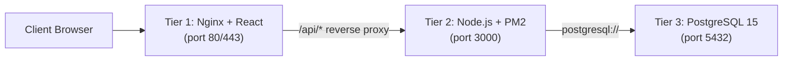
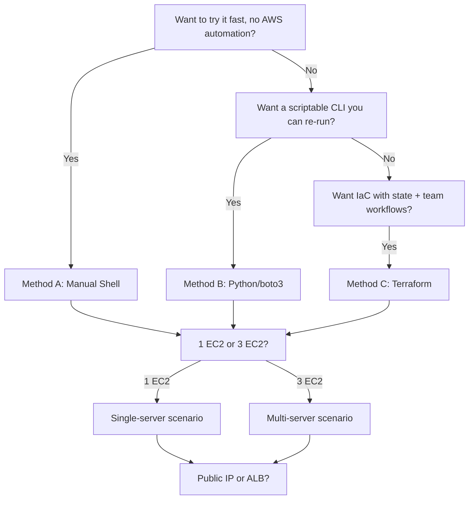

# Three-Tier AWS Deployment — BMI Health Tracker

A BMI & health tracking app (React frontend, Node.js/Express backend, PostgreSQL database) built to demonstrate **one three-tier application deployed several different ways** on Ubuntu EC2 — same app, same tiers, same install logic, regardless of which automation method or server topology you choose.

This README generalizes the deployment process so you can reason about it independent of *how* you provision (shell / Python / Terraform) or *where* each tier lands (one server or three).

---

## 1. The Three Tiers

| Tier | Component | Technology | Port |
|---|---|---|---|
| **Tier 1 — Web** | React frontend (built static files) served by Nginx, reverse-proxies `/api` | Nginx + React (Vite build) | 80 / 443 |
| **Tier 2 — App** | REST API | Node.js 22 + Express + PM2 | 3000 |
| **Tier 3 — Data** | Relational database | PostgreSQL 15 | 5432 |



The tiers **never change**. What changes between scenarios is only:
1. **Topology** — do the 3 tiers live on 1 EC2 instance, or 3 separate EC2 instances?
2. **Access mode** — public IP direct, public IP + Let's Encrypt domain, or behind an ALB with ACM/HTTPS?
3. **Automation method** — plain shell scripts, a Python/boto3 CLI, or Terraform.

---

## 2. Deployment Methods (pick one)

All three methods run the **exact same underlying shell logic** ([userdata-setup-scripts/](userdata-setup-scripts/)) — they just differ in *how that shell logic gets onto the EC2 instance* and *how the surrounding AWS infrastructure (VPC, ALB, IAM, Route53) gets created*.

| Method | Directory | Best for | Infra creation | Server bootstrap |
|---|---|---|---|---|
| **A. Manual Shell** | [userdata-setup-scripts/](userdata-setup-scripts/) | Learning, quick single-instance tests, pasting into EC2 "User data" by hand | You create the EC2/VPC/SG manually in the console | `userdata-*-bootstrap.sh` → downloads and runs `tier1/2/3-*.sh` |
| **B. Python (boto3) CLI** | [infrastructure-shell-scripts/](infrastructure-shell-scripts/) | Repeatable one-command deploy/teardown from your laptop | `deploy.py` creates VPC, subnets, SGs, EC2, ALB, Route53 via boto3 | Same `tier1/2/3-*.sh` scripts, passed as EC2 user-data |
| **C. Terraform** | [terraform/](terraform/) | Infrastructure-as-code, state tracking, team workflows | `terraform apply` creates the same AWS resources declaratively | Same `tier1/2/3-*.sh` logic, templated into `.tftpl` user-data files |

> Because all three methods call the **same** `tier1-frontend.sh`, `tier2-backend.sh`, and `tier3-database.sh` scripts (from GitHub raw, at instance boot), the actual software installed on each server is identical no matter which method you used to provision it.

---

## 3. Topology (pick one)

Independent of the method above, choose how many EC2 instances host the 3 tiers:

### Single-server (all 3 tiers on 1 EC2 instance)
- One instance runs DB → Backend → Frontend, installed **in that order**, all pointing at `localhost`.
- Simplest to reason about; good for demos / low-traffic / cost-sensitive setups.

### Multi-server (1 EC2 instance per tier)
- Tier 3 (DB) and Tier 2 (Backend) typically sit in **private subnets**.
- Tier 1 (Frontend) is the only tier reachable from the internet (directly, or behind an ALB).
- Backend is configured with `-DbHost=<db-private-ip>`; Frontend is configured with `-BackendHost=<backend-private-ip>`.

### Access mode (combine with either topology)
| Mode | How traffic reaches Tier 1 | TLS |
|---|---|---|
| `public` (no domain) | Direct to EC2 public IP | None (plain HTTP) |
| `public` + domain | Direct to EC2 public IP, Route53 A record → domain | Let's Encrypt (certbot), auto-issued by `tier1-frontend.sh` |
| `alb` | Application Load Balancer in front of Tier 1 | ACM certificate on the ALB (created outside these scripts) |

---

## 4. The Generalized Install Order (applies to every method/topology)

Regardless of shell / Python / Terraform, and regardless of 1 server or 3 servers, every deployment follows this same sequence at boot (via EC2 user-data):

1. **Tier 3 — Database** ([tier3-database.sh](userdata-setup-scripts/tier3-database.sh))
   Installs PostgreSQL 15, creates the `bmi_user` role + `bmi_health` database, and applies the schema migration ([database/migrations/001_create_measurements.sql](database/migrations/001_create_measurements.sql)).
2. **Tier 2 — Backend** ([tier2-backend.sh](userdata-setup-scripts/tier2-backend.sh))
   Installs Node.js 22 + PM2, clones the repo, `npm ci --omit=dev` on [backend/](backend/), writes `.env` with `DATABASE_URL` pointing at Tier 3, verifies the DB connection, then starts the API under PM2.
3. **Tier 1 — Frontend** ([tier1-frontend.sh](userdata-setup-scripts/tier1-frontend.sh))
   Installs Node.js + Nginx (+ certbot if a domain is set), clones the repo, `npm ci && npm run build` on [frontend/](frontend/), deploys the static build to Nginx's web root, and writes an Nginx config that reverse-proxies `/api/` to Tier 2.

In **single-server** mode, `tier1-frontend.sh` automatically chains steps 1 and 2 first (when `-BackendHost=localhost` and `-DbPassword` is set) before doing its own frontend setup — so a single user-data script does the whole stack.

In **multi-server** mode, each script runs independently on its own instance, connected via private IPs you pass as parameters.

---

## 5. Method A — Manual Shell (fastest way to try it)

Use the files in [userdata-setup-scripts/](userdata-setup-scripts/) directly. Launch a plain Ubuntu 22.04/24.04 EC2 instance, paste the relevant bootstrap script into **User data**, edit the few variables at the top, and launch.

| Scenario | Paste this as EC2 User Data |
|---|---|
| Single-server (all-in-one) | [userdata-frontend-bootstrap.sh](userdata-setup-scripts/userdata-frontend-bootstrap.sh) with `BACKEND_HOST="localhost"` and `DB_PASSWORD="yourpass"` set |
| Multi-server: DB instance | [userdata-database-bootstrap.sh](userdata-setup-scripts/userdata-database-bootstrap.sh) |
| Multi-server: Backend instance | [userdata-backend-bootstrap.sh](userdata-setup-scripts/userdata-backend-bootstrap.sh) (set `DB_HOST` to the DB instance's private IP) |
| Multi-server: Frontend instance | [userdata-frontend-bootstrap.sh](userdata-setup-scripts/userdata-frontend-bootstrap.sh) (set `BACKEND_HOST` to the backend instance's private IP) |

Each bootstrap script simply does:
```bash
curl -fsSL <raw-github-url-of-tierN-script> -o /tmp/setup.sh
bash /tmp/setup.sh -Param=value ...
```
so you can also run the underlying `tier1/2/3-*.sh` scripts directly over SSM/SSH if you prefer full manual control.

**Verify:**
```bash
aws ssm start-session --target <instance-id>
sudo tail -f /var/log/bmi-frontend-setup.log   # or bmi-backend-setup.log / bmi-db-setup.log
```

---

## 6. Method B — Python (boto3) CLI

Use [infrastructure-shell-scripts/deploy.py](infrastructure-shell-scripts/deploy.py) to create the full AWS stack (VPC, subnets, security groups, EC2 instances, optional ALB/Route53) and pass the same tier scripts as user-data automatically.

```bash
cd infrastructure-shell-scripts
pip install -r requirements.txt

# Single-server, public IP, no domain
python deploy.py --scenario single-public --db-password yourpass

# Single-server, private + ALB (HTTPS via ACM)
python deploy.py --scenario single-alb --db-password yourpass

# Multi-server, public IP, no domain
python deploy.py --scenario multi-public --db-password yourpass

# Multi-server, private + ALB (HTTPS via ACM)
python deploy.py --scenario multi-alb --db-password yourpass

# Add --domain + --cert-email to any "public" scenario for Let's Encrypt HTTPS
python deploy.py --scenario multi-public --db-password yourpass \
  --domain your.domain.com --cert-email you@example.com

# Preview only, zero AWS calls
python deploy.py --scenario single-public --db-password x --dry-run

# Tear down everything the last deploy created
python deploy.py --teardown
```

Config defaults (AWS profile, region, AMI, VPC CIDR, ACM/Route53 IDs) live in [infrastructure-shell-scripts/config.py](infrastructure-shell-scripts/config.py) — edit these for your own AWS account before running.

Scenario logic lives in [infrastructure-shell-scripts/scenarios/](infrastructure-shell-scripts/scenarios/); shared building blocks (VPC, security groups, ALB, DNS, EC2, teardown) live in [infrastructure-shell-scripts/core/](infrastructure-shell-scripts/core/).

---

## 7. Method C — Terraform

Use [terraform/](terraform/) for a declarative, state-tracked deployment. The directory mirrors the same 6 scenarios:

```
terraform/
  single-server/{alb,public-http,public-ssl}/   # all 3 tiers on 1 instance
  multi-server/{alb,public-http,public-ssl}/    # 1 instance per tier
  s3-backend-bootstrap/                          # optional: remote state bucket
```

```bash
cd terraform/single-server/public-http   # or any other scenario folder
cp terraform.tfvars.example terraform.tfvars   # edit with your values
terraform init
terraform plan
terraform apply
```

Each scenario's `userdata-*.tftpl` templates embed the same tier scripts (fetched from GitHub raw at boot) seen in [userdata-setup-scripts/](userdata-setup-scripts/) — Terraform just templates the parameters (`db_password`, `domain`, instance private IPs, etc.) into the user-data before passing it to the `aws_instance` resource.

```bash
terraform destroy   # tear down this scenario's resources
```

---

## 8. Choosing a Method + Topology



---

## 9. Repository Structure

```
backend/                     Node.js/Express API source
frontend/                     React frontend source (deployed/live theme)
frontend_navy_sidebar/        Alternate UI theme (reference copy, not deployed)
frontend_clinical_minimal/    Alternate UI theme (reference copy, not deployed)
database/migrations/          SQL schema migrations, applied by tier3-database.sh
userdata-setup-scripts/        Method A: shell scripts run as EC2 user-data (source of truth for install logic)
infrastructure-shell-scripts/  Method B: Python/boto3 deploy + teardown CLI
terraform/                     Method C: Terraform modules for all 6 scenarios
```

---

## 10. Prerequisites (all methods)

- Ubuntu 22.04 or 24.04 LTS EC2 instances
- Outbound internet access (to clone GitHub, install packages, reach Let's Encrypt if used)
- An AWS account with permissions for EC2 / VPC / IAM (Methods B & C) or console access (Method A)
- A PostgreSQL password of your choosing, supplied consistently to Tier 2 and Tier 3

Whichever method or topology you pick, the app tiers, ports, install order, and verification steps are identical — only the provisioning mechanics differ.
